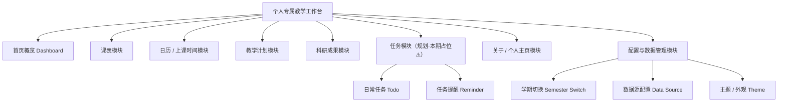

# 个人专属教学工作台网站 · 需求与功能规划（PRD-lite）

> 版本：v0.1（规划阶段）｜角色：产品经理（Xu）｜日期：2026-06-17
> 范围说明：本文件仅做**需求与功能规划**（功能范围、模块划分、页面结构），不含架构设计与代码实现。任务模块（日常任务/提醒）本期仅做规划与页面占位，不实现完整逻辑。

---

## 0. 项目概述

**用户画像**：海南省三亚某高职院校酒店管理系副教授（Miro），12 年酒店一线管理 + 近 9 年高校教学经验。主讲《酒店信息技术》《短视频拍摄与制作》《新媒体运营实务》（本学期新增，48 节）《餐饮数字化运营与管理》（开发数字教材）；研究方向为高职智慧教育改革、酒店数字化转型、酒店 AI 应用（含 RAG 课题）；运营"酒店英语""趣味树洞"两个微信公众号，有 WordPress 与自动化流水线经验。

**技术偏好**：轻量、零依赖、免重型运行时、易维护；熟悉 WorkBuddy / GitHub / Vercel 部署概念。

**项目目标**：搭建一个**个人专属教学工作台网站**，集中管理与查看「教学计划、科研成果、上课时间、课表、日常任务、任务提示与提醒」。核心诉求是用户能**自行便捷更新课表和任务**，避免每学期重新开发；强调**可维护性、可扩展性**；参考网上"班主任工作台"（网友用 WorkBuddy 制作）的思路与功能。部署优先 GitHub + Vercel，同时兼容自托管云服务器。

---

## 1. 产品目标与用户故事

### 产品目标（Product Goals）
- **G1 集中可视**：将六类教学相关信息（教学计划、科研成果、上课时间、课表、日常任务、任务提醒）集中于单站、单屏可查。
- **G2 自助更新**：用户无需开发人员即可便捷更新课表与任务，避免每学期重新开发。
- **G3 可维护可扩展**：数据结构与页面支持学期切换、历史保留，并为后续任务/提醒模块预留扩展位。

### 用户故事（User Stories）
- **US1**：作为副教授，我希望打开首页就能看到「今天上什么课、距离开学/考试还有几天」，以便快速进入工作状态。
- **US2**：作为任课教师，我希望用最简单的方式（编辑一个文件或填一张表单）更新本学期课表，以便新学期无需找人改代码。
- **US3**：作为科研工作者，我希望在「科研成果」页集中展示论文 / 课题 / 教材 / 获奖，以便对外（评审、交流）一键展示。
- **US4**：作为多课程教师，我希望能切换学期查看对应计划与课表，以便历史学期与当前学期互不干扰。
- **US5**：作为注重效率的用户，我希望工作台未来能接入日常任务与提醒，以便把教学与生活待办集中在同一站。

---

## 2. 整体功能模块图



---

## 3. 模块详细规划表

| 模块 | 职责 | 核心数据字段 | 更新频率 | 用户操作方式 |
|------|------|--------------|----------|--------------|
| **课表模块** | 管理每学期课程时间表，按星期 / 节次展示周课表 | 课程名、班级、教室、星期、节次、周次起止、课程类型、任课教师 | 每学期初；偶尔临时调课 | 编辑数据源文件（JSON / YAML / CSV）或简易表单 |
| **日历 / 上课时间模块** | 展示近期上课日、倒计时、今日课程 | 日期、课程、倒计时天数、星期、是否上课 | 由课表自动派生（无需手动） | 系统自动计算 |
| **教学计划模块** | 展示各课程教学大纲与教学进度 | 课程、章节、学时分配、教学目标、考核方式、进度周次 | 每学期 | 编辑内容文件（Markdown） |
| **科研成果模块** | 集中展示论文 / 课题 / 教材 / 获奖 | 类型、标题、时间、级别、角色、链接 / 附件 | 不定期 | 编辑内容文件 |
| **任务模块（本期占位）** | 日常待办与提醒（规划纳入，本期不实现逻辑） | 标题、截止日、优先级、状态、关联课程、提醒渠道 | 日常（未来） | 表单 / 勾选（未来） |
| **关于 / 个人主页** | 教师简介、研究方向、站点导航首页 | 姓名、职称、简介、研究方向、外链 | 偶尔 | 编辑内容文件 |
| **配置与数据管理** | 学期切换、数据源配置、主题切换 | 当前学期、学期列表、数据源路径、主题 | 每学期 | 配置文件 / 界面切换 |

---

## 4. 页面结构

### 4.1 站点导航结构

```
教学工作台
├── 首页 Dashboard（今日概览）
├── 课表 Schedule
├── 日历 Calendar
├── 教学计划 Teaching Plans
│   ├── 计划列表（各课程）
│   └── 计划详情（大纲 / 进度）
├── 科研成果 Research
├── 任务 Tasks（本期占位⚠️）
└── 关于 About
```
> 全局 Header：学期切换器、主题切换、GitHub 源码链接、移动端菜单。

### 4.2 页面用途与核心组件清单

| 页面 | 用途 | 核心组件 |
|------|------|----------|
| **首页 Dashboard** | 今日课程、倒计时、快捷入口、数据概览 | 今日课卡、倒计时组件、快捷导航、统计卡片 |
| **课表 Schedule** | 周课表网格视图（多班级 / 多课程） | 周视图表格、课程色块、按课程 / 班级筛选 |
| **日历 Calendar** | 月历标注上课日与截止日 | 月历组件、上课日标记、点击查看当日详情 |
| **教学计划** | 各课程计划列表与详情 | 课程卡片、大纲折叠面板、进度条 |
| **科研成果** | 成果分类展示 | 分类标签、时间线、卡片列表 |
| **任务（占位）** | 预留入口与占位说明 | 占位提示、未来组件预留位 |
| **关于 About** | 教师简介与导航 | 简介卡片、外链、研究方向标签 |

---

## 5. 借鉴「班主任工作台」功能点清单（高校教师场景适配）

| 班主任工作台功能 | 适配到教师工作台 | 价值 |
|------------------|------------------|------|
| 今日概览 / 数据卡片 | 首页今日课程 + 倒计时 + 本周统计 | 一屏掌握当日状态 |
| 周课表视图 | 教师周课表（多班级 / 多课程） | 直观查看排课 |
| 日历视图 | 月历标注上课日 / 截止日 | 把握时间节奏 |
| 待办清单 | 日常任务模块（规划） | 集中待办 |
| 提醒 / 通知 | 任务提醒（规划） | 临近上课 / 截止提醒 |
| 多角色 / 班级切换 | 学期切换器 | 历史与当前学期隔离 |
| 快捷编辑 | 数据源文件 / 简易表单更新课表 | 免重开发 |
| 移动端适配 | 响应式布局 | 手机随时查看 |
| 全站搜索 | 搜索课程 / 成果 / 计划 | 快速定位 |
| 统计看板 | 教学 / 科研数据概览 | 量化成果 |

---

## 6. 需求优先级

### P0（Must have · 本期原型必须交付）
- 课表模块（周视图 + 数据源可编辑）
- 日历 / 上课时间模块（由课表自动派生）
- 首页概览（今日课程 + 倒计时）
- 教学计划模块（列表 + 详情）
- 科研成果模块（分类展示）
- 关于 / 个人主页
- 学期切换机制（数据层至少支持多学期）
- 响应式移动端基础适配

### P1（Should have）
- 日历月视图与上课日标记
- 全站搜索
- 主题切换（浅色 / 深色）
- 课表临时调课标记
- 数据源可视化编辑（简易表单，非纯文件）

### P2（Nice to have）
- 任务模块完整实现（待办 + 提醒）—— 本期仅占位
- 自动化提醒（邮件 / 微信 / Webhook）
- 数据看板统计图表
- 多端部署脚本（Vercel + 自托管）
- 微信公众号 / WordPress 联动

---

## 7. 待确认问题清单（≥6 条）

1. **技术栈与运行时偏好**：用户强调「轻量、零依赖、免重型运行时」。是否采用纯静态（原生 HTML/CSS/JS 或 Astro 类静态生成）而非 Vite + React + MUI 重型栈？需与架构师确认可维护性与扩展性的平衡点。
2. **数据来源与更新方式**：课表 / 计划 / 成果的数据用何种格式承载（JSON / YAML / Markdown / CSV）？用户倾向「编辑一个文件」还是「站内表单」？是否需对接 WordPress / 既有数据？
3. **是否需要登录 / 权限**：工作台是仅个人查看（公开只读），还是需要登录后才能编辑？直接影响架构与部署复杂度。
4. **移动端适配程度**：手机端是「仅可读」还是需完整交互（含编辑）？决定响应式工作量。
5. **学期切换机制**：如何定义「学期」（如 `2025-2026-2`）？是否每学期新建数据文件，还是单文件多学期字段？历史学期是否保留查看？
6. **任务模块本期范围**：明确本期仅做「模块规划 + 页面占位」，不实现增删改与提醒逻辑；还是需最小可用原型？
7. **部署与自托管细节**：Vercel 与自托管（云服务器）是否共用同一构建产物？是否需要 CI/CD 自动部署？
8. **初始数据样例**：PRD 阶段是否需要用户提供真实课表 / 计划样例，以便架构师设计数据结构与字段？

---

## 8. 下一步需架构师澄清的关键点

- **技术栈取舍**：轻量静态站 vs React 栈 —— 直接决定目录结构、构建方式与后续维护成本（对应待确认问题 1）。
- **数据结构定稿**：课表 / 教学计划 / 科研成果的数据 schema 需先设计，建议架构师基于待确认问题 2、5 给出数据模型草案。
- **学期切换的数据组织**：多文件（每学期一份）vs 单文件多学期字段，影响切换与历史保留实现。
- **编辑方式**：文件直编 vs 站内表单 —— 决定是否需要后端服务与登录体系（对应待确认问题 2、3）。
