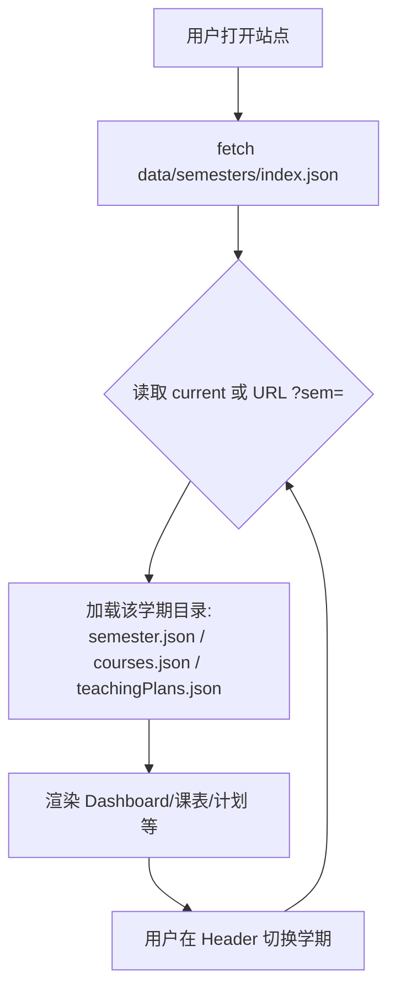
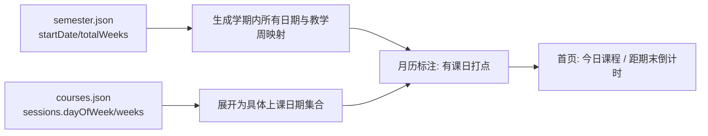
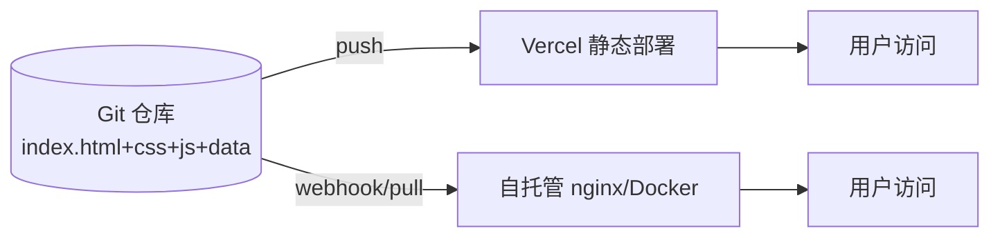

# 个人专属教学工作台 · 架构与技术方案（Architecture v0.1）

> 角色：架构师（Gao）｜日期：2026-06-18｜配套：01-prd.md（产品经理 Xu 规划）
> 范围：本期交付 = 规划 + 一个**不含任务模块**的 HTML 原型（确认范围与样式）；正式开发在用户确认后启动。

---

## 0. 结论速览（TL;DR）

| 维度 | 推荐方案 |
|------|----------|
| 技术栈 | **纯静态、零依赖、零构建**：单页 SPA 外壳 + 原生 ES Modules + JSON 数据（fetch） |
| 运行时 | **无任何前端框架**（无 React/Vue），浏览器只跑你自己的少量 JS |
| 数据承载 | 仓库内 `data/*.json`，**改文件即改内容、提交即部署** |
| 学期组织 | 按学期分目录 `data/semesters/<id>/`，全局 `index.json` 索引，历史全保留 |
| 编辑方式 | 本期＝编辑数据文件 → 提交 → 自动部署；P1 再议轻量表单 |
| 登录/后端 | **不需要**（公开只读静态站） |
| 部署 | 同一份静态文件 → Vercel（Git 自动部署）**与** 自托管 nginx/Docker 通用 |
| 任务模块 | 本期仅占位，不实现逻辑 |

> 以上 1–6 项已结合你「轻量、零依赖、免重型运行时、易维护、学期不重开发」的明确诉求**替你决策**，请在文末「待确认清单」中予以拍板确认；7–10 项仍需你最终定夺。

---

## 1. 技术栈推荐与理由（正面回应：轻量 vs React 重型）

### 1.1 取舍结论

**强烈推荐「纯静态、零依赖、零构建」路线，而非 Vite + React + MUI 重型栈。** 理由如下：

| 维度 | A. 纯静态零依赖（推荐✅） | B. Vite+React+MUI（不推荐❌） |
|------|--------------------------|------------------------------|
| 运行时重量 | 仅你自己的少量原生 JS（~几 KB~几十 KB） | React+ReactDOM+MUI ≈ 200KB+ gzip，且常驻运行时 |
| 依赖/构建 | **零 npm 依赖、零构建步骤** | 需 node、npm install、打包构建 |
| 维护门槛 | 编辑 `data/*.json` + 少量页面文件即可 | 需懂组件/状态/构建，对副教授不友好 |
| 学期不重开发 | 克隆 `data/semesters/` 文件夹改数据即可 | 同左，但工程复杂度更高 |
| 部署 | 任意静态服务器（Vercel/nginx/GitHub Pages） | 需构建产物，部署链更重 |
| 可扩展性 | 后续可渐进加原生 JS 模块（P2 图表等） | 扩展能力强但代价高 |

### 1.2 推荐实现的精确形态

- **架构模式**：数据驱动 SPA（单 `index.html` 外壳 + hash 路由，如 `#/schedule`），页面由 JS 从 JSON 渲染。
- **构建工具**：**无**。直接用浏览器原生 ES Modules（`type="module"`）+ `fetch` 读 JSON。
- **SSR/后端**：**无**。全部在浏览器端静态渲染。
- **为什么不用「纯无构建但多 HTML 文件」**：7 个页面共享 Header/Footer/布局，若各写一份 HTML 会重复且难维护；改用「单外壳 + JS 渲染模块」既零构建又复用布局，最契合「易维护」。
- **可选进阶（非必须）**：若日后想压缩/打包，可加 Vite（仅构建期，产物仍是纯静态、零框架）。**本期不引入**，保持零依赖。

### 1.3 局部技术选型

| 关注点 | 选型 | 说明 |
|--------|------|------|
| 页面渲染 | 原生 JS 函数返回 HTML 字符串，注入 `#app` | 无虚拟 DOM，足够 7 个页面 |
| 路由 | hash 路由（`location.hash`） | 静态服务器无需 rewrite，Vercel/nginx 均友好 |
| 样式 | 原生 CSS + CSS 变量（设计令牌） | 浅色/暗色主题靠变量切换 |
| 数据加载 | `fetch('data/...json')` + 内存缓存 | 同源，无 CORS 问题 |
| 图标 | 内联 SVG / 系统 emoji | 零图标库依赖 |
| 日期计算 | 原生 `Date` / `Intl` | 日历与倒计时自写轻函数 |

---

## 2. 数据存储与更新方式（核心）

### 2.1 总体原则

- **数据即内容**：所有可变更信息都放在仓库 `data/` 下，用户（副教授）主要只改这里。
- **改文件＝改网站，提交＝部署**：与 Vercel Git 集成 / 自托管 webhook 配合，实现「免重开发」。
- **跨学期数据 vs 学期内数据分离**：科研成果、关于页与「学期」无关，放 `data/` 根；课表、教学计划绑定学期，放 `data/semesters/<id>/`。

### 2.2 数据 Schema 草案（JSON）

> 字段与 PRD 模块表对齐。下列为草案，命名可在确认后微调。

#### 2.2.1 学期清单 `data/semesters/index.json`

```json
{
  "current": "2025-spring",
  "semesters": [
    { "id": "2025-spring", "name": "2025 春季学期", "code": "2025-2" },
    { "id": "2024-fall",   "name": "2024 秋季学期", "code": "2024-3" }
  ]
}
```

#### 2.2.2 学期元信息 `data/semesters/<id>/semester.json`

```json
{
  "id": "2025-spring",
  "name": "2025 春季学期",
  "code": "2025-2",
  "startDate": "2025-02-24",
  "endDate": "2025-06-27",
  "totalWeeks": 18,
  "current": true
}
```

#### 2.2.3 课表 `data/semesters/<id>/courses.json`

> 字段对齐 PRD：课程名、班级、教室、星期、节次、周次起止、课程类型、任课教师。

```json
{
  "semesterId": "2025-spring",
  "courses": [
    {
      "id": "hotel-it",
      "name": "酒店信息技术",
      "code": "HOT201",
      "type": "必修",
      "credit": 3,
      "teacher": "Miro",
      "classes": ["酒店2301", "酒店2302"],
      "location": "实训楼 B305",
      "color": "#2563eb",
      "sessions": [
        { "dayOfWeek": 1, "start": "08:00", "end": "09:40", "weeks": "1-18", "note": "" },
        { "dayOfWeek": 3, "start": "10:00", "end": "11:40", "weeks": "1-18", "note": "" }
      ]
    },
    {
      "id": "short-video",
      "name": "短视频拍摄与制作",
      "code": "MED310",
      "type": "选修",
      "credit": 2,
      "teacher": "Miro",
      "classes": ["酒店2303"],
      "location": "融媒体实验室",
      "color": "#0ea5e9",
      "sessions": [
        { "dayOfWeek": 2, "start": "14:00", "end": "15:40", "weeks": "1-16", "note": "单周" }
      ]
    }
  ]
}
```

- `dayOfWeek`：1=周一 … 7=周日
- `weeks`：教学周区间，如 `"1-18"`、`"1-16(单周)"`；P1 再精细化单双周/调课
- `color`：课表色块底色（也用于日历标记）

#### 2.2.4 教学计划 `data/semesters/<id>/teachingPlans.json`

> 字段对齐 PRD：课程、章节、学时分配、教学目标、考核方式、进度周次。

```json
{
  "semesterId": "2025-spring",
  "plans": [
    {
      "id": "plan-hotel-it",
      "courseId": "hotel-it",
      "courseName": "酒店信息技术",
      "title": "课程整体教学计划",
      "summary": "面向高职酒店管理的酒店信息系统与数字化运营基础。",
      "objectives": ["掌握 PMS 基本流程", "理解酒店数据中台"],
      "assessment": "平时 40% + 期末 60%",
      "chapters": [
        { "no": 1, "title": "酒店信息系统概述", "hours": 4, "week": "1-2", "status": "done" },
        { "no": 2, "title": "PMS 实操", "hours": 6, "week": "3-5", "status": "in-progress" },
        { "no": 3, "title": "餐饮数字化", "hours": 4, "week": "6-7", "status": "planned" }
      ],
      "materials": ["syllabus.pdf"]
    }
  ]
}
```

- `status`：`planned | in-progress | done`（驱动进度条与配色）

#### 2.2.5 科研成果 `data/publications.json`（跨学期，全局）

> 字段对齐 PRD：类型、标题、时间、级别、角色、链接/附件。

```json
{
  "items": [
    {
      "id": "pub-1",
      "type": "journal",
      "title": "高职院校智慧教育改革的路径研究",
      "authors": ["Miro", "李某某"],
      "venue": "中国职业技术教育",
      "year": 2025,
      "month": 3,
      "level": "核心",
      "role": "第一作者",
      "links": { "pdf": "https://...", "doi": "" },
      "tags": ["智慧教育"],
      "highlight": true
    },
    {
      "id": "pub-2",
      "type": "book",
      "title": "餐饮数字化运营与管理（数字教材）",
      "authors": ["Miro"],
      "venue": "XX 出版社",
      "year": 2025,
      "month": 1,
      "level": "",
      "role": "主编",
      "links": {},
      "tags": ["数字教材", "餐饮"],
      "highlight": false
    }
  ]
}
```

- `type` 取值：`journal | conference | book | patent | project | award`

#### 2.2.6 关于/个人主页 `data/about.json`（全局）

```json
{
  "name": "Miro",
  "title": "副教授",
  "affiliation": "XX 职业技术学院 酒店管理系",
  "avatar": "assets/avatar.jpg",
  "bio": "12 年酒店一线管理 + 近 9 年高校教学经验，研究方向为高职智慧教育、酒店数字化转型与 AI 应用。",
  "researchAreas": ["高职智慧教育", "酒店数字化转型", "酒店 AI 应用（RAG）"],
  "education": [
    { "degree": "硕士", "school": "XX 大学", "year": 2015 }
  ],
  "contact": { "email": "miro@xx.edu.cn", "office": "实训楼 408" },
  "links": {
    "github": "https://github.com/...",
    "scholar": "https://scholar.google.com/...",
    "wechat": "酒店英语 / 趣味树洞"
  }
}
```

#### 2.2.7 配置与数据管理

- **学期切换 / 当前学期**：由 `data/semesters/index.json` 的 `current` 字段驱动（见第 3 节）。
- **数据源路径**：固定为仓库 `data/`，无需可配置（保持简单）。
- **主题**：由前端 `theme.js` + `localStorage` 控制，无需数据文件。

### 2.3 「用户如何更新」

```
编辑 data/semesters/2025-spring/courses.json
        │
        ▼
git commit && git push
        │
        ├─▶ Vercel：Git 推送触发自动重新部署（默认行为）
        │
        └─▶ 自托管：webhook → 服务器 git pull → 静态文件已更新（或 CI 产物同步）
```

- **本期（P0）**：仅文件直编 + 提交部署，零后端、零表单。
- **P1 可选轻量表单**：提供一个「填写表单 → 生成 JSON」的辅助页（纯前端，输出 JSON 文本/下载），用户把结果贴回仓库并提交。**不建后端、不存密码**。

### 2.4 是否需要登录/后端

**结论：不需要。** 工作台定位为「个人公开只读展示站」。无登录、无数据库、无服务端逻辑——这是满足「轻量、零依赖、易维护、学期不重开发」的关键前提。编辑通过 Git 提交完成，天然有版本历史与回溯。

---

## 3. 学期切换机制

### 3.1 设计选择：多文件按学期分目录（推荐✅）

| 方案 | 说明 | 评价 |
|------|------|------|
| **A. 多文件按学期分目录** ✅ | `data/semesters/<id>/{semester,courses,teachingPlans}.json` + `index.json` | 每学期自包含；**克隆文件夹即开新 semester**，最契合「避免每学期重开发」；历史天然保留 |
| B. 单文件多学期字段 | 一个 `courses.json` 内含所有学期数组 | 文件越来越大、易冲突、难定位 |

### 3.2 历史保留策略

- 所有学期目录**永久保留**在仓库，可随时切回查看。
- `index.json` 的 `semesters` 列出全部学期；`current` 标记默认展示项。
- 切换学期 = 仅改变前端加载的数据源，**不改变 URL 之外的任何代码**。

### 3.3 切换时的数据加载流程



- 纯前端、无后端；加载结果在内存缓存，避免重复请求。
- 日历/倒计时由 `courses.json` + `semester.json` 在浏览器端**实时派生**（见 3.4），不单独存数据。

### 3.4 日历/上课日派生逻辑（由课表自动计算，无需手填）



- 输入：`semester.startDate`、`totalWeeks`、`courses[].sessions[{dayOfWeek, weeks}]`
- 输出：某日期是否上课、当日课程列表、距开学/期末天数
- `weeks:"1-18"` → 映射到 `startDate` 起的第 1~18 周对应星期几；`(单周)` 等规则 P1 细化

---

## 4. 界面布局与视觉规范（给工程师建原型用）

### 4.1 整体布局

- **顶栏 Header（全局固定）**：左侧站点名/Logo；中部导航（桌面横排，移动端折叠为汉堡菜单）；右侧工具区＝学期切换器、主题切换（🌙/☀️）、GitHub 链接。
- **内容区**：最大宽度约 1200px 居中，卡片栅格（桌面多列、移动单列）。
- **页脚 Footer（可选轻量）**：版权 + 最后更新提示。
- 无独立侧边栏（顶栏导航已足够，移动端更友好）；若日后模块增多可加左侧可收起侧栏。

```
┌──────────────────────────────────────────────────┐
│ Header: 教学工作台 │导航│ [学期▾] [🌙] [GitHub] [☰] │
├──────────────────────────────────────────────────┤
│                                                    │
│            内容区（卡片栅格，max-w 1200）          │
│                                                    │
├──────────────────────────────────────────────────┤
│ Footer: © Miro · 最后更新 2026-06-18              │
└──────────────────────────────────────────────────┘
```

### 4.2 设计系统（设计令牌）

> 以 CSS 变量定义，浅色为默认，暗色覆盖同名变量。

| 令牌 | 浅色值 | 暗色值 | 用途 |
|------|--------|--------|------|
| `--color-primary` | `#2563eb` | `#60a5fa` | 主色（按钮、链接、强调） |
| `--color-primary-deep` | `#1e3a5f` | `#0f2440` | 顶栏/标题深蓝（稳重专业） |
| `--color-accent` | `#0ea5e9` | `#38bdf8` | 次强调（课程类型/外链） |
| `--color-warn` | `#f59e0b` | `#fbbf24` | 提醒/高亮（倒计时临近） |
| `--color-success` | `#22c55e` | `#4ade80` | 已完成/进行中 |
| `--color-bg` | `#f8fafc` | `#0b1220` | 页面背景 |
| `--color-surface` | `#ffffff` | `#111c2e` | 卡片背景 |
| `--color-text` | `#0f172a` | `#e2e8f0` | 正文 |
| `--color-muted` | `#64748b` | `#94a3b8` | 次要文字 |
| `--color-border` | `#e5e7eb` | `#1f2a3a` | 边框/分隔线 |
| `--radius` | `12px` | `12px` | 卡片圆角 |
| `--radius-sm` | `8px` | `8px` | 按钮/标签圆角 |
| `--space` | `8px` 基准（4/8/16/24/32） | 同 | 间距栅格 |
| `--shadow` | `0 1px 3px rgba(0,0,0,.08)` | `0 1px 3px rgba(0,0,0,.4)` | 轻阴影 |

- **字体**：中文 `system-ui, "PingFang SC", "Microsoft YaHei", sans-serif`；西文 `Inter, system-ui`；等宽（代码/编号）`ui-monospace, "SF Mono", Menlo`。
- **卡片**：`surface` 底 + 1px `border` + `--radius` + `padding:16~20px` + `--shadow`。
- **表格（课表）**：7 列（周一～周日）× 节次行；课程色块填充单元格（`color` 字段）；周末列淡化；表头 sticky。
- **标签（Pill）**：`padding:2px 10px`、`radius:999px`、小字、按类别着色。
- **进度条**：细条 + `--color-success` 填充，按 `status` 配比。

### 4.3 核心页面布局草图

#### 首页 Dashboard
```
┌─────────────────────────────────────────────┐
│ Header: 工作台 |学期:[2025春▾] [🌙] [⌘] [☰] │
├─────────────────────────────────────────────┤
│ 2025-06-18 周三      距期末 9 天  ⚠ 临近     │
│ ┌────────┐ ┌────────┐ ┌────────┐            │
│ │今日课程│ │本周课时│ │进行计划│            │
│ │  3 节  │ │ 10 节  │ │ 5/8 章 │            │
│ └────────┘ └────────┘ └────────┘            │
│ 今日课程卡:                                  │
│  08:00 酒店信息技术 @实训楼B305              │
│  10:00 新媒体运营实务 @融媒体实验室          │
│ 快捷入口: [课表][日历][计划][成果][关于]     │
└─────────────────────────────────────────────┘
```

#### 课表（周视图）
```
┌─────────────────────────────────────────────┐
│ 课表  周次:[第12周▾]  筛选:[全部课程▾]        │
├──────┬───────┬───────┬───────┬──────────────┤
│ 节次 │ 周一  │ 周二  │ 周三  │ … 周日        │
├──────┼───────┼───────┼───────┼──────────────┤
│ 1-2  │酒店IT │       │酒店IT │              │
│      │B305   │       │B305   │              │
│ 3-4  │       │短视频 │       │              │
│ ...  │       │       │       │              │
└──────┴───────┴───────┴───────┴──────────────┘
```

#### 日历（月视图，标注上课日）
```
┌─────────────────────────────────────────────┐
│ 日历  2025-06  [◀] [▶]                        │
├─────────────────────────────────────────────┤
│ 一 二 三 四 五 六 日                         │
│     1  2● 3  4  5● 6  7                      │
│  8  9 10●11 12 13●14                         │
│ ...（●=上课日，点击查看当日课程）            │
└─────────────────────────────────────────────┘
```

#### 教学计划（列表 + 详情）
```
┌─────────────────────────────────────────────┐
│ 教学计划  学期:2025春                         │
│ ┌─────────────────────────────────────────┐ │
│ │ 酒店信息技术  [大纲▾]  进度 ████░░ 60%   │ │
│ │ 新媒体运营实务 [大纲▾] 进度 ██░░░░ 30%  │ │
│ └─────────────────────────────────────────┘ │
│ 详情: 章节列表 + 学时 + 周次 + 状态徽标       │
└─────────────────────────────────────────────┘
```

#### 科研成果（分类）
```
┌─────────────────────────────────────────────┐
│ 科研成果  筛选:[全部|论文|教材|课题|获奖▾]    │
│ ┌── 2025 ────────────────────────────────┐  │
│ │ 📄 论文: 高职智慧教育… 核心·一作       │  │
│ │ 📘 教材: 餐饮数字化运营与管理          │  │
│ ├── 2024 ────────────────────────────────┤  │
│ │ …                                       │  │
│ └────────────────────────────────────────┘  │
└─────────────────────────────────────────────┘
```

#### 关于 / 个人主页
```
┌─────────────────────────────────────────────┐
│ 关于                                          │
│ [头像] Miro  副教授  酒店管理系               │
│ 简介: 12年酒店管理 + 9年高校教学…            │
│ 研究方向: #智慧教育 #酒店数字化 #AI          │
│ 外链: GitHub | Scholar | 公众号              │
└─────────────────────────────────────────────┘
```

---

## 5. 目录结构（推荐）

```
laogong/                         # 仓库根 = 站点根
├── data/                        # ★用户主要编辑区（数据即内容）
│   ├── semesters/
│   │   ├── index.json           # 学期清单 + current
│   │   ├── 2025-spring/
│   │   │   ├── semester.json
│   │   │   ├── courses.json
│   │   │   └── teachingPlans.json
│   │   └── 2024-fall/ ...
│   ├── publications.json        # 科研成果（跨学期）
│   └── about.json               # 关于/个人主页
├── assets/                      # 静态资源（头像/附件）
│   └── avatar.jpg
├── css/
│   ├── tokens.css               # 设计变量（颜色/间距/圆角）
│   ├── theme-light.css
│   ├── theme-dark.css
│   └── main.css
├── js/
│   ├── app.js                   # 入口 + hash 路由
│   ├── lib/
│   │   ├── data.js              # 数据加载与缓存（fetch）
│   │   ├── semester.js          # 学期切换/当前学期
│   │   ├── calendar.js          # 上课日/倒计时派生
│   │   └── theme.js             # 主题切换 + localStorage
│   ├── pages/                   # 各页面渲染模块
│   │   ├── dashboard.js
│   │   ├── schedule.js
│   │   ├── calendar.js
│   │   ├── teachingPlans.js
│   │   ├── research.js
│   │   └── about.js
│   └── components/              # 复用组件（返回 HTML 字符串）
│       ├── header.js
│       ├── card.js
│       └── courseBlock.js
├── index.html                   # SPA 外壳（含 <div id="app">）
├── README.md                    # 使用与更新说明（写给副教授）
├── vercel.json                  # Vercel 静态配置（可选，hash 路由可省）
└── Dockerfile                   # 自托管可选（nginx 多阶段）
```

> 原型阶段（本期）可先只产出一个自包含 `prototype.html`（数据内联），验证范围与样式后再落地上述结构（见第 9 节）。

---

## 6. 部署方案（Vercel + 自托管共用同一产物）

### 6.1 核心理念

**同一份静态文件 = 既可在 Vercel 跑，也可原样放到 nginx。** 因为零构建、零后端，产物就是 `index.html + css/ + js/ + data/ + assets/` 这套目录本身。

### 6.2 Vercel 部署

- 方式：Git 仓库连 Vercel（GitHub），**推送即自动部署**（默认静态）。
- 构建：无（或 `npm run build` 为空脚本）。输出目录＝仓库根。
- `vercel.json`（可选，hash 路由无需 rewrite；若改用 history 路由再加）：
  ```json
  { "rewrites": [{ "source": "/(.*)", "destination": "/index.html" }] }
  ```
- 环境变量：无。数据全在仓库。

### 6.3 自托管（Linux + 宝塔 / nginx）

- 直接把仓库目录作为静态站点根，nginx 指向 `index.html`：
  ```nginx
  server {
    listen 80;
    root /var/www/laogong;
    index index.html;
    location / { try_files $uri $uri/ /index.html; }
  }
  ```
- 自动更新（可选）：Git Webhook → 脚本 `git pull` 拉取最新（数据文件变更即生效）。
- 可选 Docker（多阶段，构建期可省，直接 nginx 托静态）：
  ```dockerfile
  FROM nginx:alpine
  COPY . /usr/share/nginx/html
  # 若用 history 路由，覆盖 default.conf 加 try_files
  ```

### 6.4 两者关系图



---

## 7. 依赖包列表（最小）

**运行时依赖：0（零 npm 依赖）。**
**构建依赖：0（零构建）。**

仅建议提供可选的开发者便利（非必须）：

```
# package.json（可选，仅本地预览用，不进产物）
{
  "scripts": {
    "dev": "python3 -m http.server 5173",   // 或 npx serve .
    "build": "echo 'static, no build'"
  }
}
```

- 不引入 React / Vue / MUI / Tailwind / 任何 UI 库。
- 图标、日期、渲染均用原生能力实现。
- 若 P2 要图表，优先选零依赖轻量方案（如自绘 SVG），避免引入重型图表库。

---

## 8. 待确认问题清单（≤10，已决策 vs 待拍板）

| # | 问题 | 我的建议 / 已决策 | 状态 |
|---|------|-------------------|------|
| 1 | 技术栈（轻量静态 vs React 重型） | **已决策**：纯静态零依赖零构建（SPA+ES Modules+JSON） | 已替你决策，请拍板确认 |
| 2 | 数据格式（JSON/YAML/MD/CSV） | **已决策**：JSON（前端 fetch 零解析依赖） | 已替你决策，请拍板确认 |
| 3 | 学期数据组织（多文件/单文件） | **已决策**：按学期分目录 + `index.json`，历史全保留 | 已替你决策，请拍板确认 |
| 4 | 编辑方式（文件直编/站内表单） | **已决策(P0)**：文件直编+提交部署；P1 再议轻量表单 | 已替你决策，请拍板确认 |
| 5 | 是否需要登录/后端 | **已决策**：不需要（公开只读静态站） | 已替你决策，请拍板确认 |
| 6 | 学期编码规则 | 建议 `YYYY-semester`（如 `2025-spring`）或校历 `2025-2` | **待你拍板** |
| 7 | 主色与主题色 | 建议学术蓝 `#2563eb` + 深蓝 `#1e3a5f`，浅/暗双主题 | **待你拍板**（或给偏好色） |
| 8 | 科研成果分类维度 | 建议按 `type`（论文/课题/教材/获奖/专利）分组 + 可按年筛选 | **待你拍板** |
| 9 | 课表→日历派生细节 | 建议原型仅标「有课日」；单双周/调课留 P1 | **待你拍板**（是否原型先体现） |
| 10 | 自托管部署方式 | 建议 nginx 静态 + Git Webhook 自动拉取；或手动 rsync / Docker | **待你拍板** |

> 说明：1–5 已基于你明确的「轻量、零依赖、免重型运行时、易维护、学期不重开发」诉求**替你决策**，强烈建议采纳；如无异议请确认，确认后我将据此进入工程师原型阶段。6–10 需要你结合个人偏好与学校实际情况定夺。

---

## 9. 给工程师的备注（原型阶段）

**目标**：产出一个**不含任务模块**的 HTML 原型，用于确认功能范围与视觉样式。

1. **交付物**：1 个自包含 `prototype.html`（数据以 `<script type="application/json">` 内联，避免本地预览的 fetch/CORS 问题；双击或任意静态服务器可开）。确认后正式版再落地第 5 节目录结构（数据外置到 `data/`）。
2. **覆盖页面**（hash 路由切换即可）：
   - 首页 Dashboard（今日课程 + 倒计时 + 统计卡 + 快捷入口）
   - 课表（周视图网格 + 课程色块）
   - 日历（月视图标注上课日 ●，点击看当日课程）
   - 教学计划（列表 + 大纲折叠详情 + 进度条）
   - 科研成果（按类型/年分类卡片）
   - 关于（简介 + 研究方向标签 + 外链）
   - ⚠️ **不含**「任务」模块（本期占位，原型可省略或仅留「敬请期待」占位）。
3. **Mock 数据**（贴合酒店管理系背景）：
   - 1 个学期 `2025-spring`（18 周）
   - 5–6 门课：酒店信息技术 / 短视频拍摄与制作 / 新媒体运营实务 / 餐饮数字化运营与管理 等
   - 每课 1 份教学计划（含 3–5 章、进度状态）
   - 6–8 条科研成果（论文/教材/课题混合，跨 2024–2025）
   - 1 份 about（姓名/职称/简介/研究方向/外链）
4. **套用视觉规范**：第 4.2 节设计令牌（学术蓝主色 + 浅/暗双主题变量、卡片圆角 12px）；顶栏含学期切换器（mock 可切换验证样式）、主题切换（mock 浅/暗）、GitHub 链接、移动端汉堡菜单。
5. **响应式**：移动端顶栏汉堡 + 内容单列；课表在窄屏改为「按日纵向列表」或横向滚动，避免挤压。
6. **交互验证**：学期切换器、主题切换在原型中用 mock 切换验证样式与布局即可，不必接入真实多学期数据加载。
7. **路由**：原型用简单 hash（`#/schedule`）或 tab 切换验证各页面布局，确认范围即可。

---

> 文档结束。架构师（Gao）建议：1–5 项已替用户决策（契合其轻量诉求），待用户拍板确认后即可进入原型开发；6–10 项需用户结合偏好与校情定夺。
